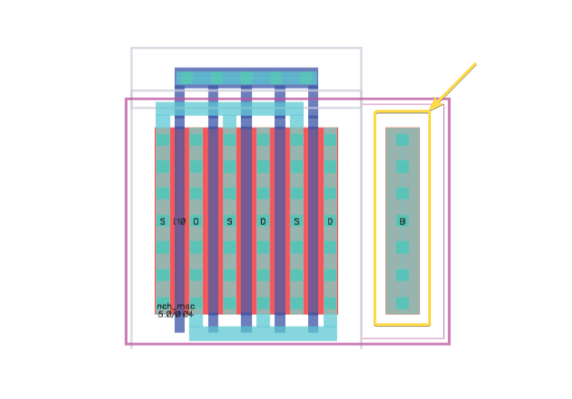
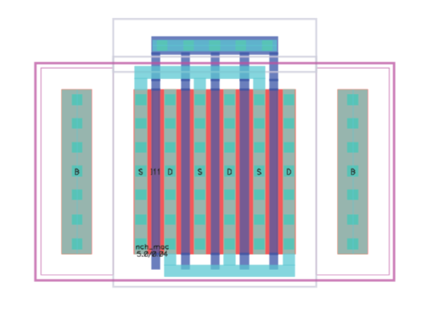
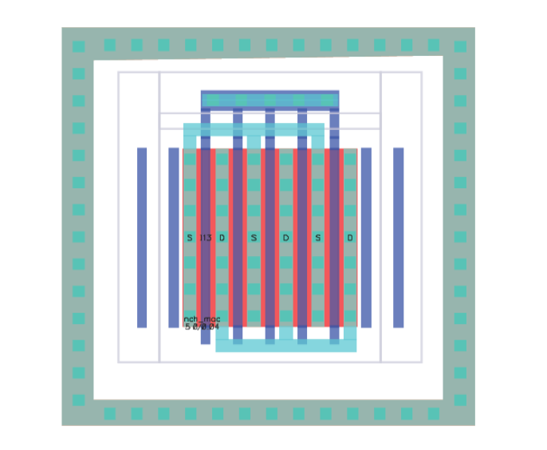
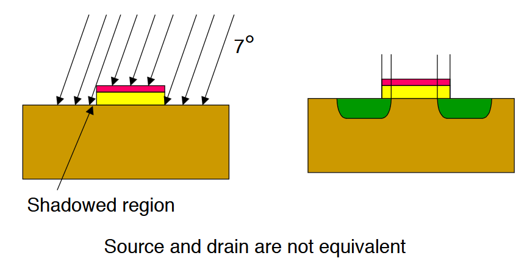
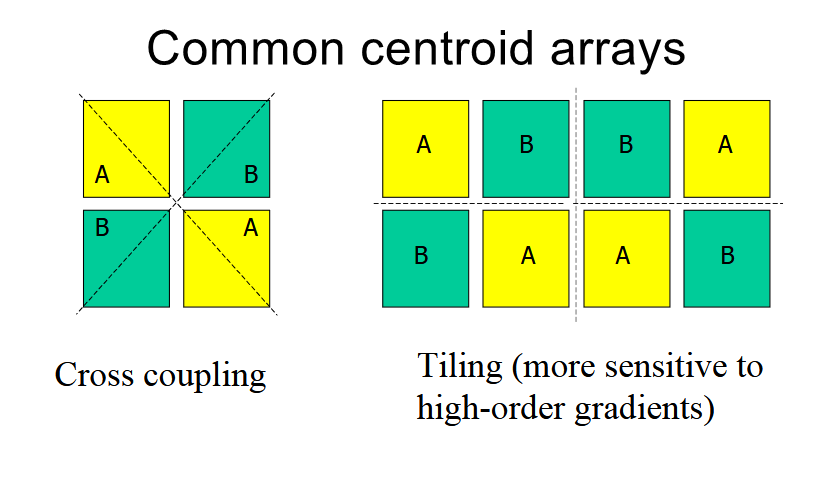
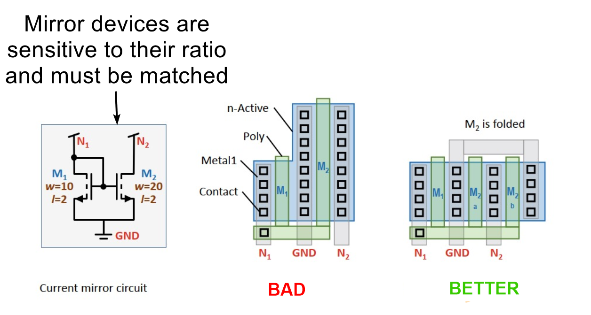
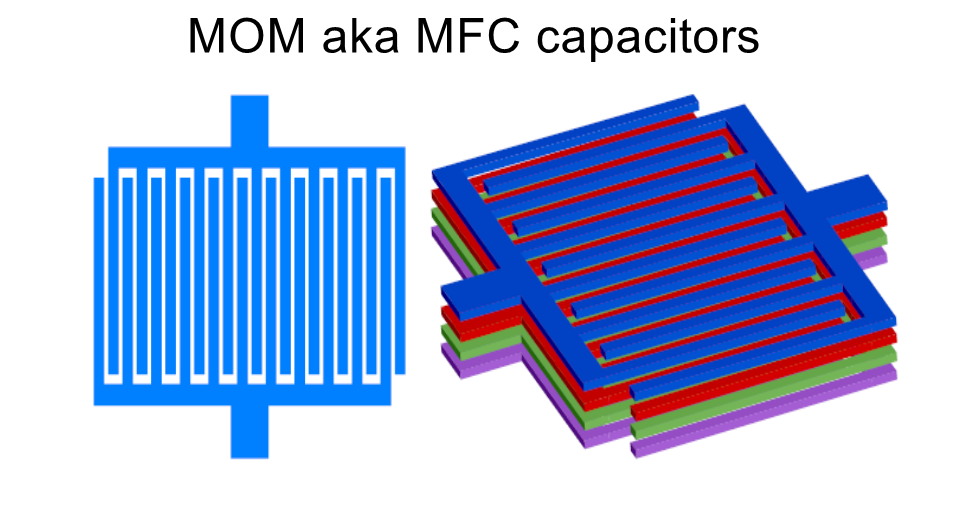
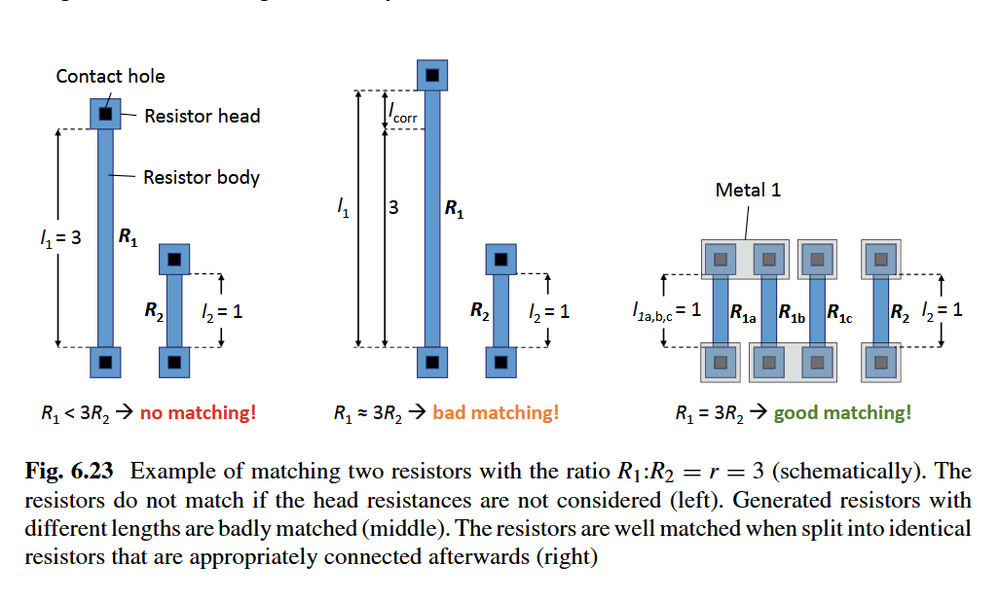
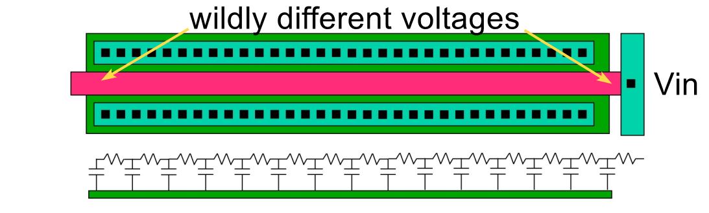
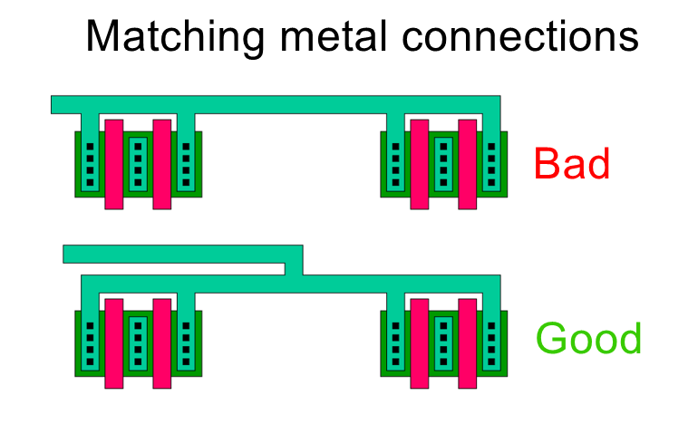

# Analog Layout Guide 

## Best references

### Core layout and packaging

[Razavi Analog CMOS - Ch.19 Layout and Packaging](./Razavi_Analog_CMOS_-_Ch.19_Layout_and_Packaging.pdf)

Topics covered by Razavi Ch.19:
- Analog layout techniques and best practices
- Current mirror layout and matching considerations
- Passive device layout (resistors, capacitors)
- Interconnect design and crosstalk reduction
- Device matching techniques
- Layout for high-precision circuits
- Common layout pitfalls and solutions

### Layout and matching

Ali Niknejad Spring 2021 EE 194/290C Lecture series:

- [Lecture 1 - Virtuoso Introduction](./resources/Niknejad_290C_Lecture-1-Virtuoso_Intro.pdf)
- [Lecture 2 - Layout](./resources/Niknejad_290C_Lecture-2-Layout.pdf)
- [Lecture 3 - Matching](./resources/Niknejad_290C_Lecture-3-Matching.pdf)

[Maloberti Layout of Analog CMOS ICs](./resources/Maloberti_Layout_of_Analog_CMOS_ICs.pdf)

[Lienig, Scheible, "Fundamentals of Layout Design for Electronic Circuits," Springer 2020](./Lienig_Fundamentals_of_Layout_Design_for_Electronic_Circuits.pdf)

### Passive component layout

- [Niknejad 242B Module 1.3 - Passives](./resources/Niknejad_242B_Module_1_3_Passives-2.pdf)
- [Chien 240B Lecture 3 - Passives](./resources/Chien_240B_lec3_passives.pdf)

## Substrate and body contacts 

In both planar MOSFETs and FinFETs, we are often guilty of thinking of them as three-terminal devices (gate, drain, and source) because those are the terminals we actively drive. 

However, these transistors are truly four-terminal devices: gate, drain, source, and body/substrate. The body (or bulk) terminal is for setting the device's operating point and ensuring proper isolation and biasing in an integrated circuit.

In a schematic, the body node is typically drawn as a separate terminal on the MOS symbol. But in the actual layout, this same body (or bulk) connection appears as substrate contacts, "taps," or tap cells:

In many simpler or smaller analog layouts, you might place substrate taps on either side of your active device.
This provides two direct pathways to the substrate, ensuring reasonably low-resistance paths from the
device body to ground (for NMOS) or to VDD (for PMOS).

### Guard rings

Instead of just placing body contacts on the left and right (or top and bottom), you can create a continuous "ring" or guard structure of substrate contacts around the device. This is often referred to as a **guard ring** when it fully encircles the transistor or transistor array.

The ring can act like a shield that helps keep substrate noise out (or in). In sensitive analog circuits, this can be very important for performance.

Fully surrounding devices with taps can reduce latch-up risk by providing abundant substrate tie points. 
- **In the Intel 16 process, it is MANDATORY that any device which connects to a bump be enclosed by a guard ring.**    

Another benefit, for PMOS devices and deep NWELL NMOS, is that the entire perimeter of the
 device is tied to the desired well potential which will minimize uneven substrate gradients.

## Layout matching

When designing analog circuits, the geometry and arrangement of devices determine parasitic resistances, capacitances, device mismatches, and noise coupling.
Although schematic simulations capture many effects, physical layout contributes additional variations that are not always obvious until tapeout. 

Below is an overview of key concepts and best practices.

### Systematic vs random mismatch

Image from [F. Maloberti, "Layout of Analog CMOS Integrated Circuits" (Part 2)](./resources/Maloberti_Layout_of_Analog_CMOS_ICs.pdf). This is an example of a **systematic mismatch** due fabrication, where the wafer is intentionally tilted by ~7 degrees to prevent channeling of implanted ions. This creates shadowing and mismatch
in source/drain doping.

In analog layouts, mismatch is often categorized as:

**Systematic (layout-induced) offset**: Caused by non-identical device surroundings, metal 
routing differences, or doping variations due to implants hitting the wafer at
slight angles. Careful layout can greatly reduce these systematic offsets
(for example, by using symmetrical placement and consistent routing).

**Random (local) mismatch**: Arises from fundamental process variations in doping and 
line-edge roughness. Each transistor, resistor, or capacitor on the same die can differ
slightly in parameters like $V_{TH}$ or sheet resistance.

**Systematic mismatch can be mitigated with symmetry and common-centroid techniques.**

**Random mismatch is improved by using larger device sizes or arrays of parallel "unit cells."**

> **Rule of thumb**: Matching devices should always be placed as close as possible to each other in the layout. The smaller the layout distance, the less unknown gradients—regardless of what causes them and their magnitude—can contribute to a mismatch.
> 
> From [Lienig, Scheible, "Fundamentals of Layout Design for Electronic Circuits," Springer 2020](./Lienig_Fundamentals_of_Layout_Design_for_Electronic_Circuits.pdf).
> Page 248.

### Common-centroid and interdigitation

Common-centroid layout arranges matched devices (like current-mirror transistors or differential pairs) such that any gradient across the die affects each device in the same way. Placing device segments in an interleaved pattern (e.g., "ABBAABBA" or similar) ensures that if there is a continuous gradient from left to right, each transistor or unit gets an equal piece of that gradient. This dramatically reduces offset due to wafer-level or chip-level process gradients.

Image from [F. Maloberti, "Layout of Analog CMOS Integrated Circuits" (Part 2)](./resources/Maloberti_Layout_of_Analog_CMOS_ICs.pdf).

In simpler interdigitated layouts, two transistors (A and B) are arranged as alternating fingers on the same row (A-B-A-B, etc.). This approach promotes symmetrical surroundings, though it may be less effective for large spatial gradients than full common-centroid patterns.

#### Interdigitation Patterns

Basic interdigitation patterns used - these balance process gradients and improve matching.

| Number of Cells | 1D Patterns | 2D Patterns | 3D Patterns | 4D Patterns |
|-----------------|-------------|-------------|-------------|-------------|
| A (single device) | A | AA | AAA | AAAA |
| AB (two devices) | AB* | ABBA | ABBAAB* | ABABBABA |
| ABC (three devices) | ABC* | ABCCBA | ABCBACBCA* | ABCABCCBACBA |
| ABCD (four devices) | ABCD* | ABCDDCBA | ABCBCADBCDA* | ABCDDCBAABCDDCBA |
| ABA (ratio 2:1) | ABA | ABAABA | ABAABAABA | ABAABAABAABA |
| ABABA (ratio 3:2) | ABABA | ABABAABABA | ABABAABABAABABA | ABABAABABAABABAABABA |
| AABA (ratio 3:1) | AABA* | AABAABAA | AABAAABAAABA* | AABAABAAAABAABAA |
| AABAA (ratio 4:1) | AABAA | AABAAAABAA | AABAAAABAAAABAA | AABAAAABAAAABAAAABAA |

Note: Patterns marked with * may not permit a stacked layout due to connectivity constraints.

#### Common-centroid layout patterns

Below are several common centroid patterns used, with each letter representing a unit cell of a 
particular device (e.g., A and B might be the two transistors in a differential pair).

| Pattern Name | Visual Representation | Description | Best For |
|--------------|------------------------|-------------|----------|
| Simple Interdigitated | `ABABABAB` | Basic finger interleaving in a single row | Simple current mirrors, small differential pairs |
| Cross-Coupled | `ABBA` `BAAB` | 2×2 array with diagonal symmetry | Differential pairs with moderate matching requirements |
| 2×4 Common-Centroid | `ABBAABBA` `BAABBAAB` | Larger array with better gradient cancellation | High-precision op-amp input stages |
| Checkerboard | `ABABAB` `BABABA` `ABABAB` | Alternating pattern in both dimensions | Quad devices (e.g., fully-differential circuits) |
| 3-Device Common-Centroid | `ABCCBA` `CBAABC` | Pattern for three matched devices | Triple current mirrors, 3-input comparators |
| Asymmetric Ratio | `AABBAA` `BAAAAB` | For intentional device ratios (e.g., 4:2) | DACs, gain stages with specific ratios |

### Symmetry and unit cells

Well-designed analog blocks exploit symmetry to reduce mismatches. For instance, in differential pairs or current mirrors,
each transistor is laid out with identical orientation, guard rings, and spacing to body contacts. 

When possible, repeated devices should be grouped into consistent "unit cells" with carefully replicated surroundings. This helps ensure each sub-device experiences the same environment for doping, stress, and parasitic effects.

### Current mirrors and differential pairs

When matching is critical (e.g., in a current mirror or the input pair of an op amp), it is common to:

- Split each transistor into multiple identical fingers rather than using a single large finger.
- Interleave the fingers of matched transistors.
- Route signals symmetrically to reduce IR drops and parasitic mismatches on either branch.
- Share junctions (e.g., stacking source/drain diffusions) when transistors are series-connected, such as in cascode or stacked current sources.

Ensuring the routing path to each transistor is the same length and has the same number of vias helps maintain symmetrical resistance and capacitance, which is particularly important for high-gain, high-precision circuits.

### Passives

#### Capacitors

Accurate capacitor ratios are often vital in sample-and-hold circuits, filters, and DAC/ADC networks. Common capacitor structures in CMOS include:

- MOS capacitor (poly gate over substrate), which can be large and non-linear but useful for bypass or Miller compensation.

- MOM capacitors (metal-oxide-metal) also called Metal Finger Capacitors (MFCs), which leverage lateral coupling in multiple metal layers for relatively high density without extra process steps.

For good matching, designers frequently use "unit capacitors" arranged in a common-centroid pattern, similar to matched transistors.

#### Resistors

Image from [Lienig, Scheible, "Fundamentals of Layout Design for Electronic Circuits," Springer 2020](./Lienig_Fundamentals_of_Layout_Design_for_Electronic_Circuits.pdf).

Standard CMOS processes typically prioritize transistors and interconnect, so pure resistors can be somewhat ad hoc. Designers often use:

- **Diffusion or poly resistors** which are simple to implement but can have high temperature or voltage coefficients.

- **Silicide-blocked regions** which increase the sheet resistance of diffusion or poly for larger resistor values.

Like transistors, resistors that must match or maintain a precise ratio are laid out in unit segments, repeated and placed in symmetrical arrays. Contacts and corners are carefully managed to reduce systematic mismatch. Keep in mind that absolute resistor accuracy is typically much worse than relative matching, so ratio-based designs (like feedback networks) are easier to optimize than designs requiring a precise absolute resistance.

## IR Drop

IR drop **CANNOT BE IGNORED** in modern nodes, particularly when wide metal lines are not used for power/ground or high-current paths. 

Narrow metals and too few vias can introduce tens of ohms of parasitic resistance, which can skew bias voltages and degrade matching. 

Always consider adding more metal width and multiple vias to keep IR drops minimal and symmetrical.

Image from [F. Maloberti, "Layout of Analog CMOS Integrated Circuits" (Part 2)](./resources/Maloberti_Layout_of_Analog_CMOS_ICs.pdf).

### Matching IR drop

Image from [Lienig, Scheible, "Fundamentals of Layout Design for Electronic Circuits," Springer 2020](./Lienig_Fundamentals_of_Layout_Design_for_Electronic_Circuits.pdf).

