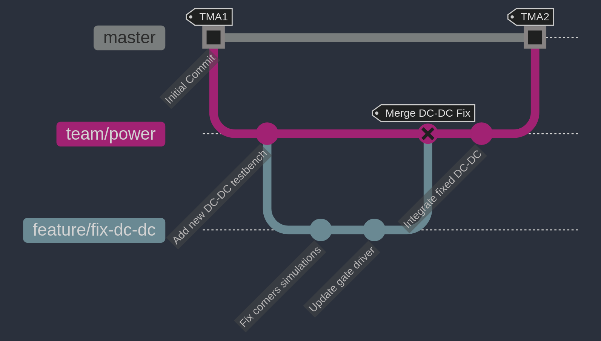

# Git Guide

## Quick prerequisite: Git basics

If you're new to Git or want a fast refresher, review one or two of these before continuing:

- **Pro Git – Git Basics (official book)**: [Getting Started → Git Basics](https://git-scm.com/book/en/v2)
- **GitHub Docs – Using Git**: [docs.github.com → Using Git](https://docs.github.com/en/get-started/using-git)
- **Atlassian Git Tutorials**: [atlassian.com/git/tutorials](https://www.atlassian.com/git/tutorials)
- **Learn Git Branching (interactive)**: [learngitbranching.js.org](https://learngitbranching.js.org/)
- **Git Cheat Sheet (PDF)**: [GitHub Training Git Cheat Sheet](https://training.github.com/downloads/github-git-cheat-sheet.pdf)


## Pull request flow & branching strategy

Our Git workflow is designed so that each team can develop independently while still converging on a stable `master` branch for final tapeout. Please follow the guidelines below.

### 1. Branch structure

We maintain these main branches:
- **`master`**  
  The stable branch containing the most up-to-date, verified code/design. No one should commit directly to `master` unless it’s a final, approved merge.

- **Team branches** (e.g. `team/rf-analog`, `team/power`, `team/dsp`, `team/integration`)  
  Each major team has its own branch for collaborative development. For example, if you’re on the **Power team**, you’ll typically work in `team/power`.

- **Feature branches** (e.g. `feature/fix-dc-dc`, `feature/rf-mixer-tweak`)  
  When you start a new feature or bug fix, you can branch **off your team branch** (or in some cases directly off `master`), do your changes, then merge back into the team branch via a PR. Once the team branch is stable, it is merged into `master`. You don't HAVE to use feature branches for everything, but it can be convenient to avoid stepping on your teammates' toes.

**Visual Overview:**

```bash
master
 ├── team/dsp
 │    └── feature/adc-filter-fix
 ├── team/power
 │    └── feature/fix-dc-dc
 ├── team/rf-analog
 │    └── feature/vco-tuning
 └── team/integration
      └── feature/innovus-floorplan-update
```

### 2. Basic workflow

### Clone the repository
```bash
git clone git@github.com:neu-ucb-tvip/tvip-analog-workspace.git
cd tvip-analog-workspace
```

### Check out your team branch
   For example, if you’re on the Power team:

```bash
git fetch origin
git checkout -b team/power origin/team/power
```

If the branch doesn’t exist locally, use `-b`. Otherwise, just checkout it.

### Create a feature branch

You don't always need to create a feature branch to do work
on your team branch. But it can be useful to compartmentalize
your work and reduce the risk of conflicts between team members.

If you need to fix something or add a feature, create a new branch based on your team branch:
```bash
# Make sure you have the latest changes from remote
git checkout team/power
git pull  
git checkout -b feature/fix-dc-dc
```

Name the branch something descriptive!

### Do your work
   Make changes to your RTL, layout scripts, etc.
   Periodically `git add .` or `git add <specific-file>` to stage changes.
   Commit frequently with clear messages:
```bash
git commit -m "Fix DC-DC cross-corner simulation bug"
```

### Push to remote & open a pull request
Push your feature branch to GitHub:
```bash
git push origin feature/fix-dc-dc
```

Go to GitHub and open a pull request from feature/fix-dc-dc -> team/power.
In the PR description, link relevant Issues (e.g., “Closes #123”).
Add your teammates as reviewers if needed.

### Code review & merge
Your teammates or TAs review your changes.
Once approved, merge your feature branch into the team branch.
If your feature is large, consider squash merging to keep commit history clean.

### Merging team branches into master
When your team is ready (i.e., you’ve tested thoroughly), open a new PR from `team/power` -> `master`.
After final review, it gets merged into `master`.
This ensures `master` is always stable and up-to-date with each team’s collective work.


### Diagram example of the branching strategy



The diagram above illustrates a typical Git workflow:
1. Initial commit (TMA1)
   - Project starts on `master` branch

2. Team branch creation
   - Create `team/power` from `master`
   - Add initial dc-dc testbench work

3. Feature development
   - Create `feature/fix-dc-dc` branch
   - Make two commits:
     - Fix corner simulations
     - Update gate driver

4. Feature integration
   - Merge `feature/fix-dc-dc` into `team/power`
   - Tag as "merge dc-dc fix"

5. `master` integration (TMA2)
   - Verify `team/power` stability
   - Merge `team/power` into `master`
   - All power team updates now available in main codebase

### 3. Useful Git commands

#### Syncing your branch
Fetch and merge the latest changes
This is the case when you are on `team/power` and just
want to get updates that, for example, your teammate pushed to
the same `team/power` branch.
```bash
git fetch origin
git merge origin/team/power
```
or
```bash
git pull origin team/power
```

Keeps your local branch updated with remote changes.

#### Updating your branch from master

This is the case that you are on `team/power` and you want to
get the updates that `master` has.

While on your `team/power` branch, this will fetch and 
merge from the remote's master branch directly into your 
current branch.

It should not require you to switch branches.

```bash
# Fetch the latest changes from the remote repository
git fetch origin

# Merge the changes from master into your current branch
git merge origin/master
```
or
```bash
git pull origin master
```

#### Rebasing (advanced): If you prefer a linear history:
```bash
git pull --rebase origin team/power
```

Use rebase carefully if your team is comfortable with it.

#### Dealing with merge conflicts

Pull latest changes and attempt the merge/rebase:
```bash
git pull origin team/power
```

If conflicts occur, open the files with conflicts, fix them, then:
```bash
git add <resolved-file>
git commit
git push origin feature/fix-dc-dc
```

Once conflicts are resolved, the PR can be merged.

#### Reviewing commits before pushing

Check your commits and differences:
```bash
git status
git diff
git log
```

Amend the last commit (e.g., if you forgot to add a file):
```bash
git add forgotten_file.v
git commit --amend
git push --force-with-lease origin feature/fix-dc-dc
```

Use --force-with-lease with caution; **If you ever use --force, you MUST coordinate with teammates if others have pulled your branch.**

### 4. Git best practices

#### One issue/fix per branch

Keep branches small and focused. Avoid mixing multiple unrelated changes.

#### Meaningful commit messages

Use clear, concise messages.

Example: “Fix DC-DC converter reference error for SS corner.”

#### Don't commit large binary files

Git LFS is used for larger files, check the `.gitattributes` file for more information on what files are tracked with LFS.

#### Regularly update team branch from master

Prevent drifting too far behind. Periodically merge or rebase from `master` to keep your team branch current.

#### Use pull requests (PRs) for every change

No direct pushes to master.

PRs allow for peer review and continuous integration checks (if we configure them).

#### Tag your commits if needed

For important tapeout checkpoints, create Git tags (e.g., `checkpoint1`, `checkpoint2`, etc.) to mark design snapshots.

#### Link issues to pull requests

Add “Closes `#<issue>`” in your commit or PR description so GitHub can auto-close the issue when merged. GitHub can detect the issue number in the commit message.

#### Communicate conflicts early

If your feature affects another team’s domain, coordinate in GitHub Issues or Slack before finalizing the design.
