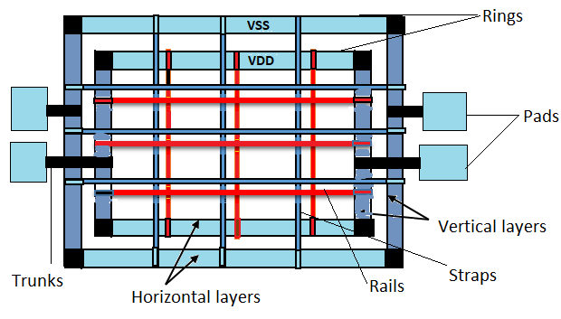
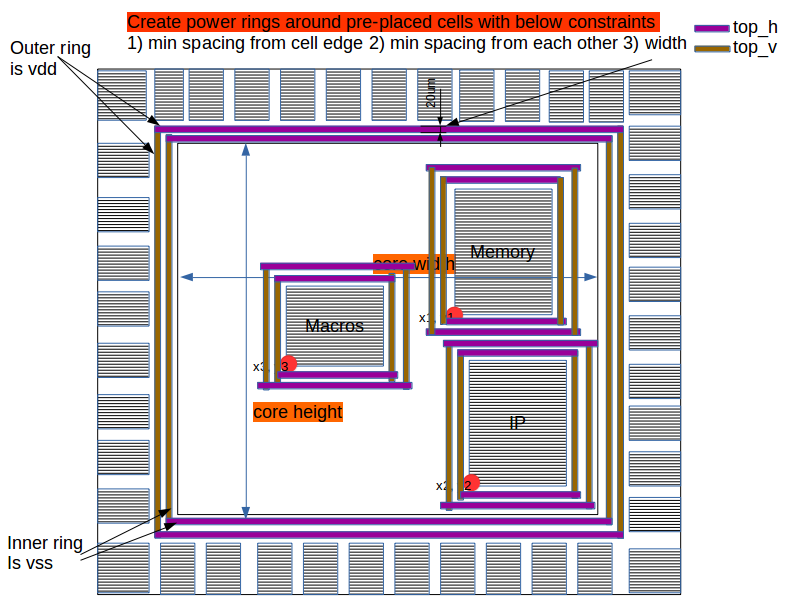
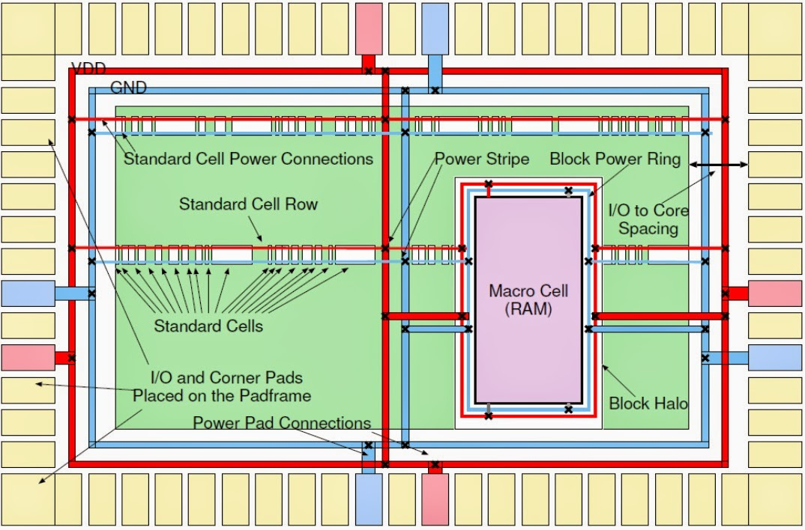
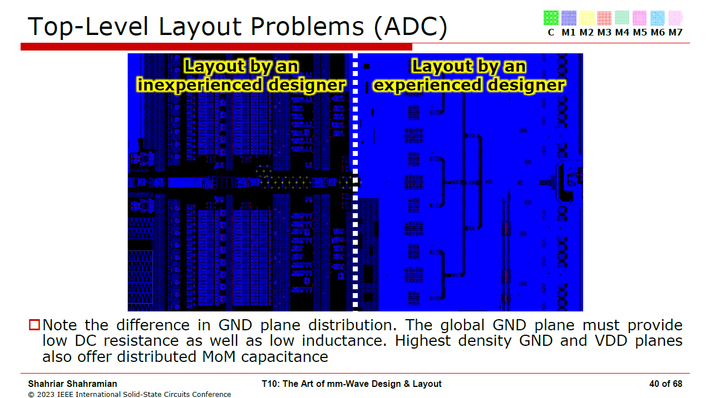
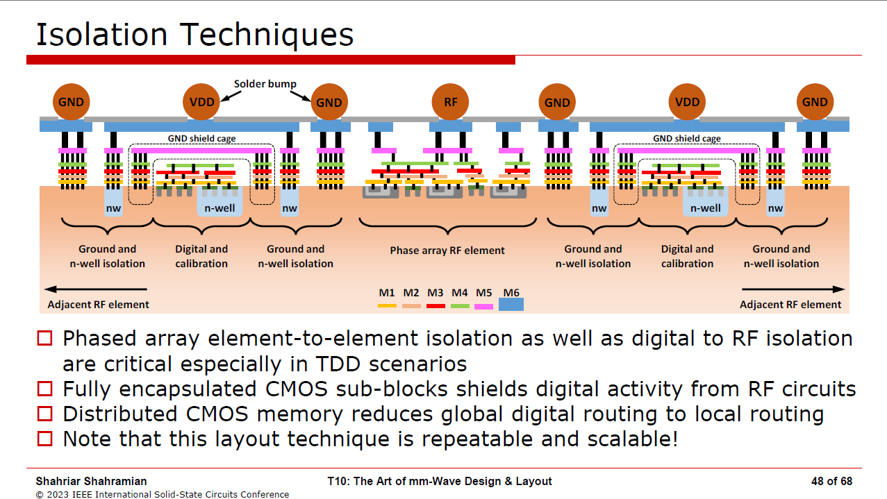
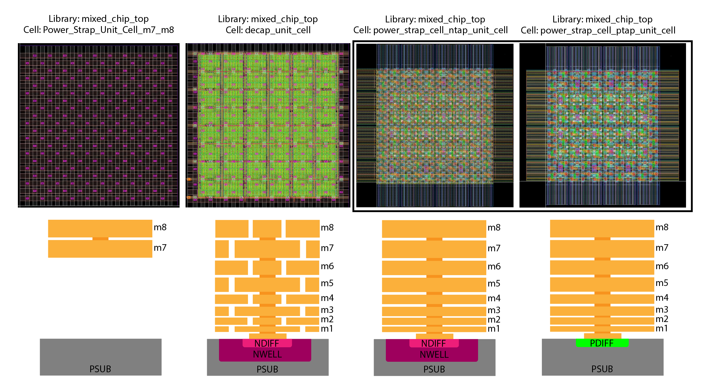

# Power Grids in VLSI

## Introduction 

In VLSI design, the power distribution network (PDN), commonly referred to as a "power grid", is responsible for delivering stable VDD and VSS potentials to all of the active devices across the die. An inadequately designed PDN can lead to major performance loss from static & dynamic IR drops, electromigration issues, and catastrophic functional failures. 

The complexity of PDN design scales with die area, power density, and operating frequency.

Generally, the structure of a power grid is a something like a tightly woven mesh network, as illustrated below:

Image source: https://www.vlsi4freshers.com/2020/01/power-planning.html

The power grid's mesh topology is constructed from orthogonal metal layers and provides multiple low-resistance paths for VDD and VSS distribution. This minimizes voltage drops by reducing the effective distance current must travel from the power sources (e.g., C4 bumps, wirebonds) to the points of load (standard cells, macros). 

The constituent stripes of the power grid are often called either "power straps" or "power stripes".

### Power straps or power stripes

Power straps are wide metal traces that form the primary horizontal and vertical conductors of the PDN mesh. They can carry substantial current across the die or within specific blocks.

### Power rings

Power rings are continuous loops of wide metal, typically encircling the entire chip periphery or individual macros (e.g., memory arrays, analog blocks). They provide a robust, low-impedance VDD/VSS supply path, enhancing supply integrity for the enclosed logic. Power rings serve as a primary mechanism for **electrical isolation**. 

Encircling a block or power domain means we can contain supply noise generated within that block and shield it from external noise coupling through the PDN. This is particularly useful in mixed-signal designs (separating analog and digital supplies) and for isolating large, noisy digital blocks from sensitive circuitry. 

Multiple concentric rings or dedicated rings for specific voltage domains or sensitive analog circuitry are common techniques to further enhance isolation and support complex power management strategies.

### Power islands

Power islands allow for more sophisticated power management techniques by partitioning the design into regions whose power supply (both the actual voltage level and the on/off state) can be independently controlled. 

The partitioning provided by power islands is useful for:
1.  **Low power modes:** Allowing inactive blocks to be completely powered down (via power gating using header/footer switches) or placed in a state-retention mode, drastically reducing static leakage power.
2.  **Dynamic Voltage and Frequency Scaling (DVFS):** Permitting different blocks to operate at distinct voltage levels and frequencies optimized for their current performance requirements. This enables the concept of DVFS, which is a technique for maximizing power efficiency.
3.  **Noise isolation:** As mentioned with power rings, defining separate islands allows for dedicated, cleaner power supplies for sensitive blocks (e.g., PLLs, ADCs/DACs), preventing noise generated by high-activity digital logic from corrupting their operation.

The concept of using rings for isolation is visualized below:

In the image, distinct power islands - surrounded by power rings - can be used to isolate different IPs within a larger design. In this case, the physical designers have decided it was best to segregate the on-chip memory from other macros and IPs. These three segregated power islands are enclosed by power rings.

Image source: https://vlsibyjim.blogspot.com/2015/03/power-planning.html

## Analog power grid construction

See the [ISSCC 2023 Art of mmWave Layout](./resources/ISSCC2023-Art-of-mmWave-Layout.pdf) by Shahriar Shahramian from Nokia - Bell Labs.

Let's start by examining the contrast between "good" and "bad" analog/RF layout power strapping approaches. In the example provided by Shahramian, the primary distinction lies in metal density and distribution patterns.

Effective power gridding and strapping for analog/RF circuits provides:
 1. Densely interwoven VDD and VSS metal routes which intrinsically provide decoupling capacitance between power domains
 2. Dense and evenly distributed connections from this power grid fabric to your circuit
 3. Low-impedance paths for both DC current and high-frequency AC components
 4. Minimal parasitic inductance in power delivery paths

You want to minimize IR drop (voltage drop due to DC resistance) and reduce parasitic inductance that would be created by having sparsely strapped power connections from the grid to your circuit. Both effects become particularly problematic at high frequencies where they can introduce noise, limit bandwidth, and degrade circuit performance.

The decoupling capacitance formed by the interdigitated structure of the power grid serves as a local charge reservoir for your analog circuits. When a circuit suddenly demands current (e.g., during switching events or rapid state changes), this capacitance provides immediate charge before the distant power supply can respond, effectively filtering out high-frequency noise and stabilizing the supply voltage. For sensitive analog circuits like oscillators, ADCs, or low-noise amplifiers, this supply stability is critical for maintaining good performance.

## Building blocks

::: warning TODO: Sky130 Implementation Needed
The building blocks described in this section (`Power_Strap_Unit_Cell_m7_m8`, `decap_unit_cell`, and `power_strap_cell_[n/p]tap_unit_cell`) do not yet exist in this repository for the Sky130 process. The images and examples shown below are from another (unnamed) process and serve as reference implementations that should be constructed for Sky130 in this repository.
:::

In this class, we have provided for you a library of "lego" cells that you can use when constructing the power grid for an analog or mixed-signal circuits.  These cells can be mosaiced across the layout to form a continuous mesh or create isolated partitions to protect sensitive blocks. 

There are three types of lego cells:
- `Power_Strap_Unit_Cell_m7_m8` Power grid "roof" cells
- `decap_unit_cell` Decap cells
- `power_strap_cell_[n/p]tap_unit_cell` Substrate isolation cells

#### `Power_Strap_Unit_Cell_m7_m8` "Roof" cell

The first lego cell, which can be thought of as a "roof" cell for your layout, is the `Power_Strap_Unit_Cell_m7_m8`. The structure interweaves VDD and VSS on m7 and m8, providing grid continuity without disrupting the underlying metal layers, active diffusion regions, or substrate. 

These "roof" cells should be placed directly above the active circuit regions to allow the power grid to descend through vias and connect directly to the underlying layout.

#### `decap_unit_cell` Decap cell

Next, there is a dedicated decoupling capacitor unit cell, `decap_unit_cell`. Unlike the "roof" cells that are restricted to m7/m8, this decap cell utilizes ALL available layers, including active device regions such as diffusion and nwell. Within this cell, there is a MFC (Metal-Finger Capacitor) between VDD and VSS, and it handles the connection of the MFC cap to the m7/m8 straps. 

You should populate any unused space in your top-level layout with these decap cells such that your circuits can benefit from a local reservoir of charge.

#### `power_strap_cell_[n/p]tap_unit_cell` Substrate isolation cells

 

Finally, there are the substrate isolation cells, `power_strap_cell_ntap_unit_cell` and `power_strap_cell_ptap_unit_cell`. These create a strong isolation wall by spanning all layers from the m8 down to substrate and nwell taps. They should be used to enclose particularly noisy blocks or sensitive analog blocks, to prevent substrate noise from coupling from one section of the design to another. 

Because these isolation cells are essentially walls, any signals that must cross from inside an isolated region to outside must be routed through pre-planned "doors" made from the `Power_Strap_Unit_Cell_m7_m8` structures.

## Examples

The example below is from Spring 2024, and shows how the Clocks team isolated one of their oscillators by enclosing it in substrate isolation straps, then created dense power grid connections from the grid fabric to the oscillator core.

Given that the substrate isolation straps span all layers, it was necessary for them to create routing "doors" using the `mixed_chip_top`/`Power_Strap_Unit_Cell_m7_m8` cells so that they could punch their I/O routes out of the grid.

This next example is also from Spring 2024, and it shows a case where the power grid is especially important: a power amplifier for the 2.4 GHz radio transmitter. This PA is very demanding on the power grid because it requires fast switching of multiple mA of current into a very small area. Without a well-connected grid, the rapid current demand can cause significant voltage drops and introduce supply ripple/line noise.

